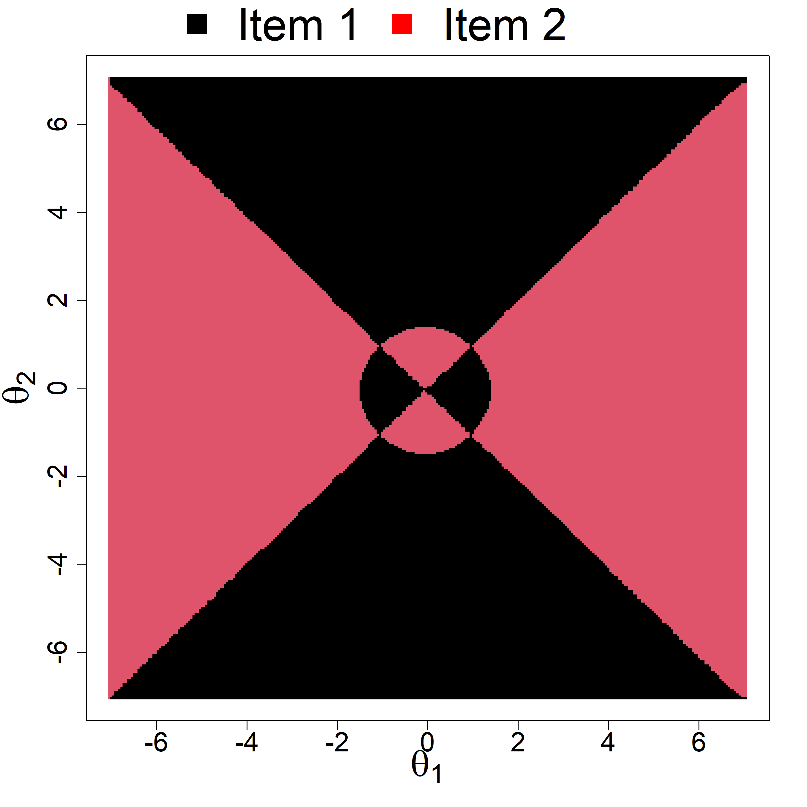

# Optimal calibration of items for multidimensional achievement tests

The R code file for the algorithm developed in the research paper "Optimal calibration of items for multidimensional
achievement tests"

The research paper is available on the following link: https://onlinelibrary.wiley.com/doi/10.1111/jedm.12386

# Acknowledgement
This work was supported by the Swedish Research Council (Vetenskapsrådet) Grant 2019-02706.
